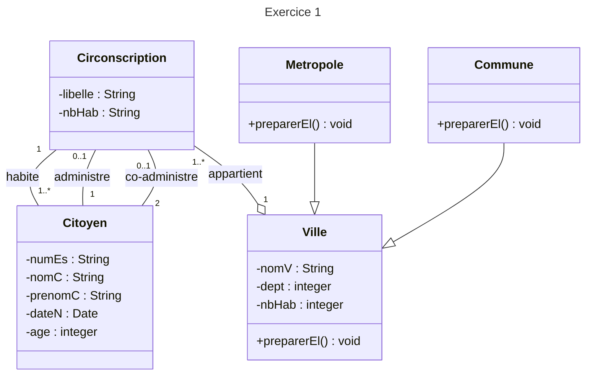
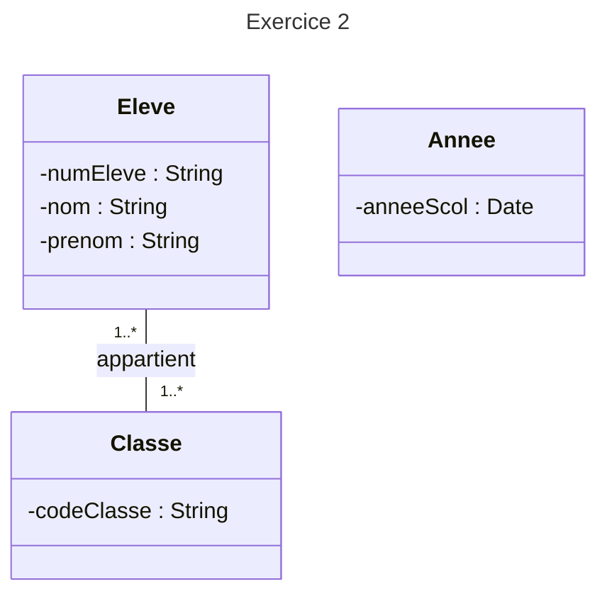

# TD1

## Exercice 1

{nbHab > 200000}\
{nbHab <= 200000}\
{age >= 18}\
numEs {frozen.id}\
{today - dateN >= 18}

## Exercice 2

Eleve : numEleve\
Classe : codeClasse\
Annee : anneeScol

Parce que codeClasse est un id donc un élève ne peut pas faire deux années dans une même classe

On ajoute :
Un attribut comme "-niveau : String" et on modifie codeClasse chaque année pour qu'un élève puisse redoubler.
