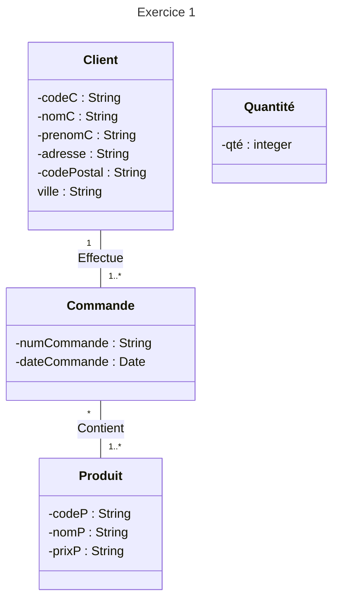

# TD2

## Exercice 1

1) Les identifiants sont : codeC, numCommande et codeP.

   a) nomC {frozen.id}\
   b) {qté > 200000}\
   c) On ajoute : -dateExpedition: Date, à la classe Commande.\
   d) On enlève la date d'expédition et on l'ajoute à la classe Produit.\
   e) On ajoute: -tempsTraitement : String et -reductionAppliquee : integer à la classe Commmande

2) numCommande {frozen.id}\
   codeP {frozen.id}\
   {prixP > 0}

3) On ajoute une classe produitsPreferes qui est reliée à Client et qui contient dix produits de type Produit

4) On ajoute une classe produitsPreferesGlobal qui contient les dix produits les plus populaires.

## Exercice 2

1) Les identifiants sont : idJoueur, sigle, numMatch et numJournée. Pour "Rencontre", c'est

https://www.youtube.com/watch?v=p5hf8i-OzlQ
