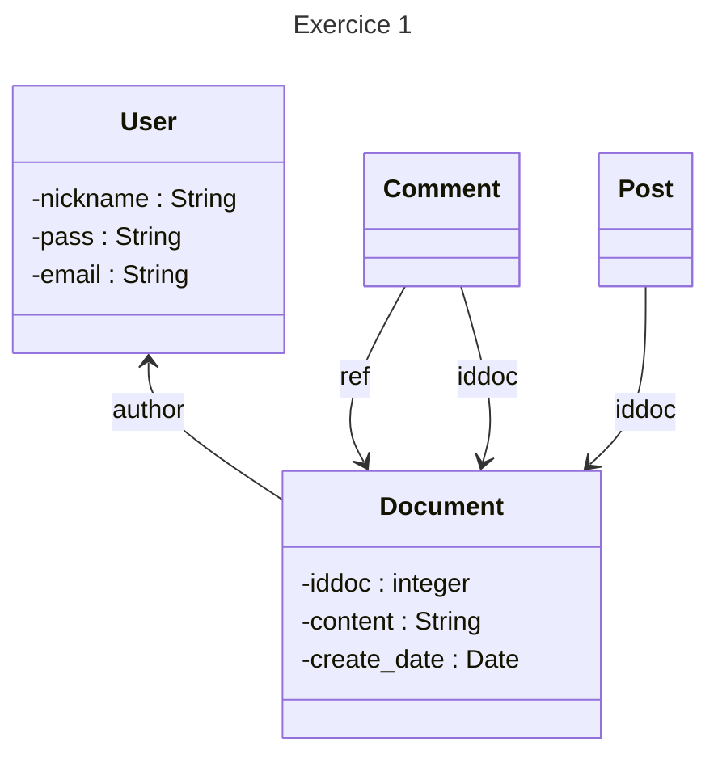

# Exercice 1

```mermaid
---
title: Exercice 1
---
classDiagram
    User <-- Document : author
    Comment --> Document : ref
    Comment --> Document : iddoc
    Post --> Document : iddoc

    class User{
        -nickname : String
        -pass : String
        -email : String
    }

    class Document{
        -iddoc : integer
        -content : String
        -create_date : Date
    }

    class Post{
    }

    class Comment {
    }
```
